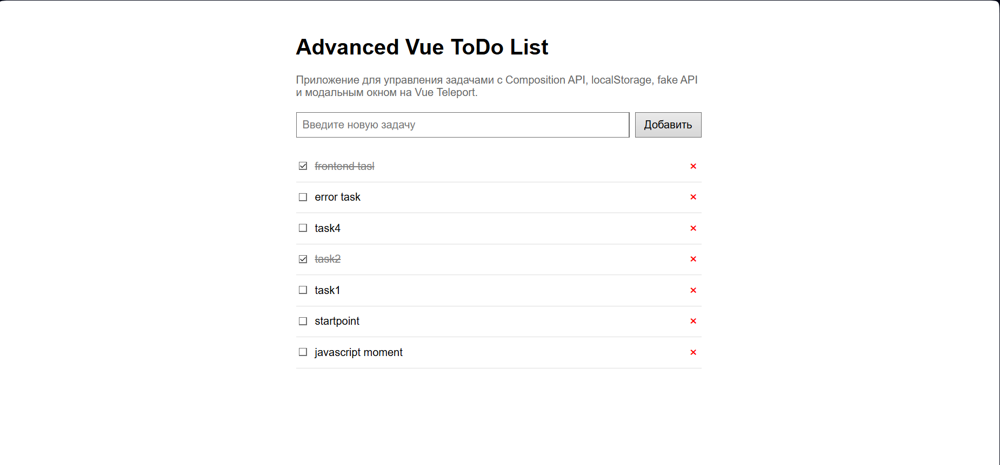
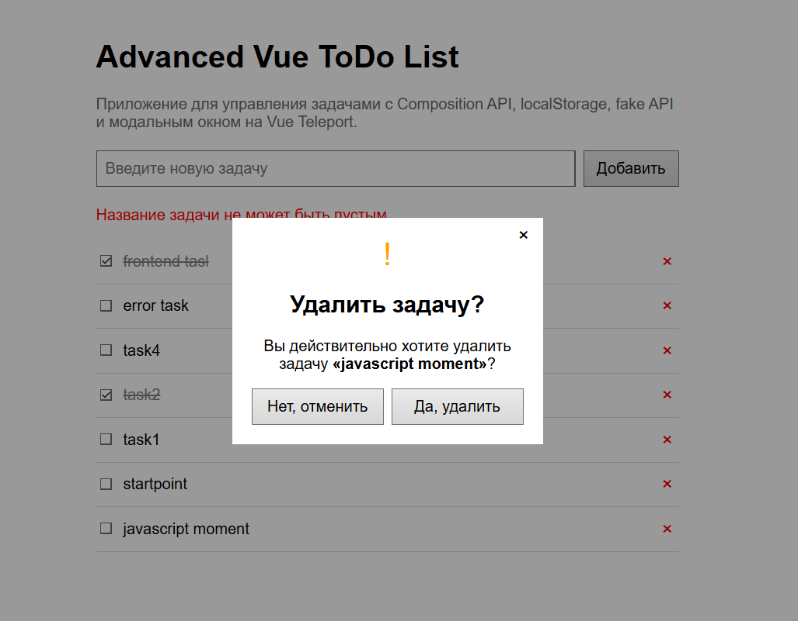
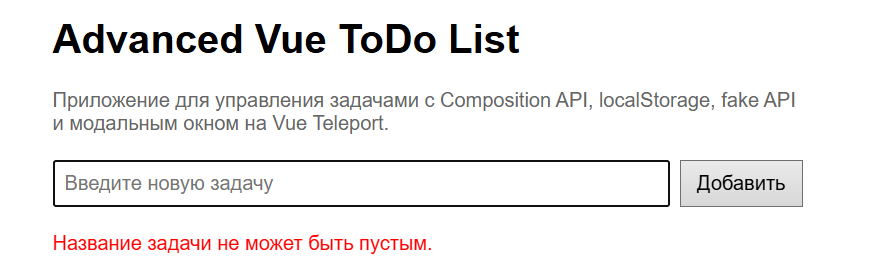

# Advanced Vue ToDo List

ToDo List на Vue .

создавать задачи, отмечать их как выполненные и удалять их после подтверждения действия во всплывающем окне.

лабораторная работа по теме **Advanced Vue**.

## Основной функционал

возможности:

- добавление новой задачи;
- отображение списка задач;
- отметка задачи как выполненной;
- удаление задачи;
- подтверждение удаления через всплывающее окно;
- сохранение задач после перезагрузки страницы;
- fake API;
- Vue Composition API;
- Single File Components;
- Vue Teleport для модального окна.


## Структура проекта

```text
src/
├── components/
│   ├── Popup.vue
│   └── TodoItem.vue
├── composables/
│   └── useTodos.js
├── services/
│   └── todoApi.js
├── App.vue
├── main.js
└── style.css
```



## Описание основных файлов

### `App.vue`

Главный компонент.

В нём находится основная разметка страницы, форма добавления задачи, список задач и подключение всплывающего окна подтверждения удаления.

Также в этом компоненте вызываются функции для загрузки, добавления, изменения и удаления задач.

### `TodoItem.vue`

Компонент отдельной задачи.

Отображение одной задачи в списке. Внутри компонента находится checkbox для изменения статуса задачи и кнопка удаления.

Компонент получает задачу через `props` и передаёт действия наружу через `emit`.

### `Popup.vue`

Компонент всплывающего окна.

Vue Teleport. Popup отображается поверх всего приложения и помещается напрямую в `body`.  Компонент поддерживает slot, поэтому внутрь него можно передавать любой HTML-контент.

### `useTodos.js`

Composable-файл с логикой работы ToDo List.

В нём находятся функции:

- загрузка задач;
- добавление задачи;
- изменение статуса задачи;
- удаление задачи;
- сохранение задач в `localStorage`;
- загрузка задач из `localStorage`.

### `todoApi.js`

внешнее API.

В нём описаны запросы:

- `GET` — получение списка задач;
- `POST` — создание задачи;
- `PATCH` — изменение статуса задачи;
- `DELETE` — удаление задачи.


## Сборка проекта

Для сборки используется команда:

```bash
npm run build
```

После выполнения команды готовая сборка появится в папке:

```text
dist/
```


## Работа с API

Каждое действие сначала отправляет запрос на API.

Состояние приложения изменяется только после успешного ответа от сервера.

При добавлении задачи используется `POST` запрос.

При изменении статуса задачи используется `PATCH` запрос.

При удалении задачи используется `DELETE` запрос.

Так как используется fake API, данные на настоящем сервере не сохраняются. Однако API возвращает успешные ответы, что позволяет имитировать реальную работу клиент-серверного приложения.

## Работа с localStorage

Для сохранения задач используется `localStorage`.

После изменения списка задач данные сохраняются в браузере. Благодаря этому задачи не исчезают после перезагрузки страницы.

При первом запуске приложение проверяет наличие сохранённых данных. Если задачи уже есть в `localStorage`, они загружаются оттуда. Если сохранённых задач нет, приложение загружает начальные данные с fake API.

## Использование Vue Teleport

В проекте реализован компонент `Popup.vue`.

Он использует конструкцию:

```vue
<Teleport to="body">
```

Это позволяет отрисовывать всплывающее окно не внутри основного компонента, а напрямую внутри тега `body`.

## Popup-компонент

```vue
<Popup :is-open="isDeletePopupOpen" @close="closeDeletePopup">
  <div class="delete-confirmation">
    <h2>Удалить задачу?</h2>

    <p>
      Вы действительно хотите удалить выбранную задачу?
    </p>

    <button @click="closeDeletePopup">
      Отмена
    </button>

    <button @click="confirmDelete">
      Удалить
    </button>
  </div>
</Popup>
```


Всё, что находится между открывающим и закрывающим тегами `Popup`, передаётся внутрь компонента через `slot`.

также есть обработка пустой задачи 

